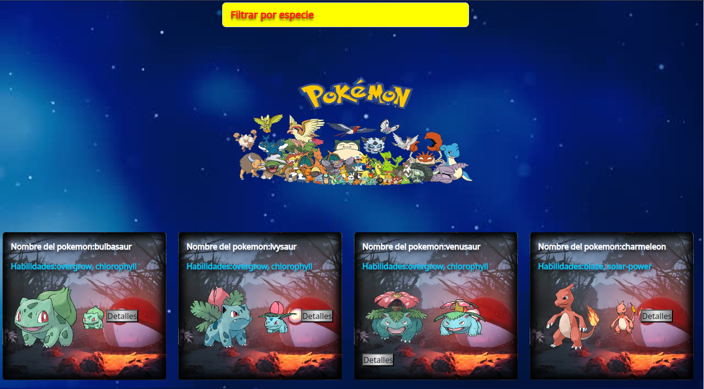
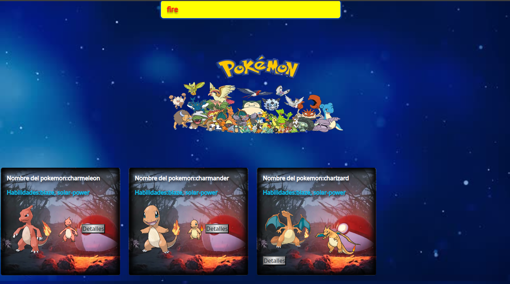
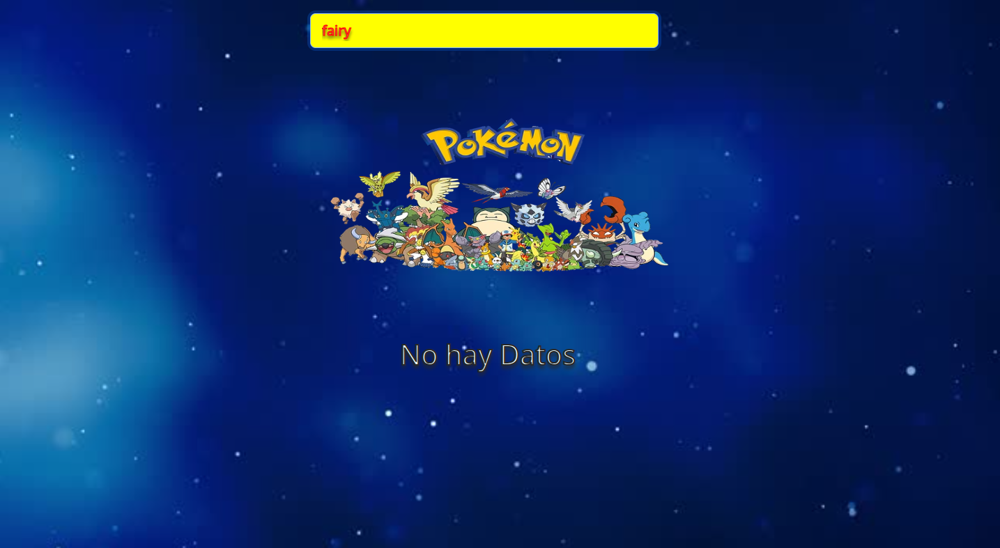

# Uso de fetch

En este proyecto se trata de como poder ir al contenido o datos de un pokemon, poder elegir un tipo de especie en la barrar de filtrar especies,en este proyecto utilice lo que es javascript,bootstrap,css,html y tambien utlizamos lo que es fetch y esto nos proporciona una interfaz JavaScript para acceder y manipular partes del canal HTTP, tales como peticiones y respuestas.

Este proyecto devuelve lo que uno le pide por ejemplo busca cuando uno busca una especie por ejemplo los pokemon fire y cuando busca un tipo de pokemon que no se encuentra sale un mensaje de (no hay datos) lo que se refiere a que no encontro una coincidencia.

